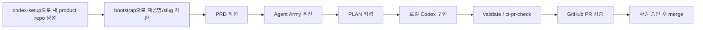

<!-- TEMPLATE_IDENTITY:START -->
# codex-setup

A public Codex product setup template for building products with a repeatable local workflow, validation layer, agent roles, and GitHub delivery guardrails.

> This repo keeps the full local Codex operating stack, validation, harness, and Product Factory contracts.
<!-- TEMPLATE_IDENTITY:END -->

`codex-setup` is a public GitHub template repo and local Codex operating system for building multiple products with the same delivery standards.

It is designed for PRD-first work, local Codex implementation, API-key-free GitHub Actions validation, and repeatable product handoff. Real product repositories should live outside this repo; this repo is the template, operating layer, and shared guardrail source.

## 한국어 안내

`codex-setup`은 여러 웹/앱 서비스를 같은 기준으로 빠르게 만들기 위한 공개 Codex 셋팅 템플릿입니다.

핵심 목적은 다음입니다.

- PRD를 먼저 쓰고 계획한 뒤 구현합니다.
- AI 코딩 작업은 기본적으로 로컬 Codex 앱/CLI에서 합니다.
- GitHub Actions는 API 키 없이 검증, QA 증거, 보안 스캔, 병합 게이트 역할만 합니다.
- 실제 제품 repo는 이 템플릿 바깥에 따로 만들고, 이 repo는 공통 셋팅/운영 레이어로 유지합니다.
- 위험한 기능인 auth, 결제, DB migration, 배포, 외부 SaaS, API key 사용은 기본으로 켜지지 않습니다.

### 이 셋팅이 좋은 점

- **새 제품 시작 속도가 빠릅니다.** PRD, 계획, agent routing, starter app, validation entrypoint가 이미 들어 있어 빈 repo에서 반복 셋팅하는 시간을 줄입니다.
- **Codex 작업 품질이 일정해집니다.** `AGENTS.md`, `.codex/agents`, `.agents/skills`가 역할, 검증, 보안 경계를 고정해 매번 다른 방식으로 일하는 문제를 줄입니다.
- **GitHub Actions에 API 키가 필요 없습니다.** 기본 CI는 AI 실행이 아니라 lint/typecheck/build, harness, browser QA, Trivy, actionlint 중심이라 공개 repo에서도 안전하게 시작할 수 있습니다.
- **실제 제품 코드와 셋팅 repo가 섞이지 않습니다.** product workspace audit가 제품별 Android/iOS/web/backend 폴더가 템플릿 안에 남는 실수를 막습니다.
- **보안 리스크를 초기에 줄입니다.** secret policy, public release audit, gitleaks/pre-commit 선택 옵션, Trivy non-blocking scan, 위험 작업 승인 규칙이 기본 포함됩니다.
- **디자인과 카피 품질 기준이 있습니다.** senior product designer, taste review, copy review 계약이 있어 AI가 만든 티가 나는 UI/문구를 줄이는 기준으로 쓸 수 있습니다.
- **작게 시작하고 나중에 확장하기 좋습니다.** Hermes, Paperclip, Graphiti, billing, deploy 같은 무거운 기능은 opt-in 계약으로만 두어 MVP 단계의 복잡도를 낮춥니다.
- **혼자 여러 서비스를 만들 때 유리합니다.** 같은 PRD/PLAN/QA/보안/배포 경계로 웹, 앱, SaaS, 대시보드, AI 서비스 아이디어를 반복 생산하기 좋습니다.

### 어떤 상황에 특히 좋은가

- 새 웹/SaaS 서비스를 빠르게 시작해야 하지만, 매번 셋팅을 다시 만들고 싶지 않을 때
- Android/iOS 앱으로 확장할 가능성이 있어도, 처음은 웹 우선으로 검증하고 싶을 때
- 혼자 여러 제품을 만들면서 PRD, 디자인, QA, 보안, 배포 경계를 같은 방식으로 유지하고 싶을 때
- GitHub Actions에 OpenAI API key를 넣지 않고도 PR 검증과 보안 스캔을 돌리고 싶을 때
- 결제, 로그인, DB, 배포처럼 위험한 기능을 처음부터 자동으로 켜지 않고, 제품별 승인 후 붙이고 싶을 때
- AI가 만든 것처럼 보이는 UI/카피를 줄이기 위해 디자이너, 카피 리뷰어, QA 역할을 기본으로 두고 싶을 때

### 포함된 것

| 영역 | 내용 |
| --- | --- |
| 제품 개발 흐름 | PRD 템플릿, PLAN 형식, worktree-first 작업 방식, GitHub 전달 정책 |
| Codex 셋팅 | `.codex` 설정, guard hook, 로컬 instructions, 44개 역할 agent |
| Agent Army | 웹 SaaS, 모바일 앱, 마켓플레이스, AI 서비스, 대시보드, 금융 민감 서비스 단계별 agent 추천 |
| Skills | PRD intake, PRD-to-plan, 구현, 리뷰, 릴리즈, secret boundary, copy/taste review, codebase mapping, verification loop |
| 실행형 starter | Next.js App Router + TypeScript + Tailwind 기반 web-first starter |
| 검증 | `./scripts/validate.sh`, `./scripts/ci-pr-check.sh`, browser QA, health smoke, harness dry-run |
| GitHub Actions | API-key-free PR validation, nightly harness, label 기반 automerge |
| 보안 | secret policy, optional pre-commit/gitleaks, non-blocking Trivy scan, actionlint/reviewdog |
| 디자인 품질 | senior product designer agent, 디자인 reference, visual QA contract, copy/taste quality contract |
| Product Factory | Hermes/Paperclip/Graphiti 계약, VPS service basecamp, revenue/admin/observability boundary |
| repo 위생 | 제품별 폴더가 템플릿 repo 안에 섞이지 않도록 public/product workspace audit 제공 |

### 기본으로 포함하지 않는 것

아래는 일부러 자동 활성화하지 않습니다.

- GitHub Actions의 `OPENAI_API_KEY`
- `openai/codex-action` 기반 자동 AI 리뷰/수정 job
- 실제 auth, 결제, DB migration, 배포, DNS 변경
- Hermes, Paperclip, Graphiti, Figma, Chromatic 같은 외부 서비스 실제 실행
- real secret, provider key, webhook URL, private endpoint
- 제품별 Android/iOS/web/backend repo를 이 템플릿 안에 두는 방식

### 빠른 시작

```bash
pnpm install
./scripts/validate.sh
python3 -m codex_runtime --operator-readiness --pretty
```

새 제품 repo에서 이름을 바꿀 때는 다음을 사용합니다.

```bash
python3 scripts/bootstrap-template.py --slug sample-product --name "Sample Product" --dry-run
python3 scripts/bootstrap-template.py --slug sample-product --name "Sample Product"
./scripts/validate.sh
```

### 추천 워크플로우

이 repo는 실제 제품 코드를 계속 넣어두는 곳이 아니라, 새 제품 repo를 만들 때 복사해서 쓰는 공통 제작 환경입니다.



1. **새 제품 repo를 만듭니다.** GitHub에서 이 repo를 복사하거나 새 repo에 가져옵니다.
2. **제품 이름을 치환합니다.**

   ```bash
   python3 scripts/bootstrap-template.py --slug sample-product --name "Sample Product" --dry-run
   python3 scripts/bootstrap-template.py --slug sample-product --name "Sample Product"
   ```

3. **PRD를 씁니다.** `PRD/_template.md`로 문제, 타깃, MVP, 제외 범위, 성공 기준을 먼저 고정합니다.
4. **필요한 agent 조합을 추천받습니다.**

   ```bash
   python3 -m codex_runtime --recommend-agents --service-type web_saas --phase discovery --pretty
   ```

5. **PLAN을 작성합니다.** 중간 이상 크기의 작업은 `PLANS/`에 실행 계획을 남긴 뒤 구현합니다.
6. **로컬 Codex로 구현합니다.** GitHub Actions에서 AI가 직접 코드를 고치게 하지 않는 것이 기본값입니다.
7. **완료 전 검증합니다.**

   ```bash
   ./scripts/validate.sh
   ./scripts/ci-pr-check.sh
   ```

8. **GitHub PR을 만듭니다.** Actions는 lint/typecheck/build, harness, browser QA, Trivy, actionlint를 검증합니다.
9. **사람이 최종 승인합니다.** required checks 통과 후 사람이 merge하거나 승인 라벨을 붙입니다.
10. **실패는 로컬에서 고칩니다.** CI 로그와 evidence artifact를 로컬 Codex에 주고 수정한 뒤 다시 push합니다.

### 역할 분담

| 역할 | 하는 일 |
| --- | --- |
| 사람 | 제품 방향, PRD 승인, 결제/auth/DB/배포 같은 위험 기능 승인, 최종 merge 판단 |
| 로컬 Codex | 구현, 리팩터링, 테스트 보강, 실패 로그 기반 수정, 문서/QA 정리 |
| Agent Army | 제품 단계별 PM/디자이너/아키텍트/개발/QA/보안/성장 역할 추천 |
| GitHub Actions | API key 없이 PR 검증, evidence 생성, 보안/워크플로우 오류 탐지 |
| Harness / audits | 실패 재현 힌트, public release 점검, product workspace 혼입 방지 |

### 제품 repo 경계

이 repo는 공통 템플릿입니다. 실제 제품 코드는 별도 repo나 sibling worktree에 둡니다.

```bash
python3 scripts/product-workspace-audit.py
python3 scripts/public-release-audit.py
```

위 audit는 제품별 코드, 개인 경로, 공개 부적합 흔적이 템플릿 repo에 섞이는 것을 막기 위한 안전장치입니다.

## What is included

| Area | Included |
| --- | --- |
| Product workflow | PRD template, PLAN format, worktree-first orchestration, GitHub delivery policy |
| Codex config | Project `.codex` config, guard hooks, local instructions, 44 role agents |
| Agent Army | Service/phase routing for web SaaS, mobile apps, marketplaces, AI services, dashboards, finance-sensitive products, and growth work |
| Skills | Local PRD intake, PRD-to-plan, implementation, review, release, secret-boundary, copy, taste, codebase mapping, and verification-loop skills |
| Runnable starter | Next.js App Router + TypeScript + Tailwind web-first starter with app, admin, and health surfaces |
| Validation | `./scripts/validate.sh`, `./scripts/ci-pr-check.sh`, browser QA wrapper, health smoke, harness dry-run |
| GitHub Actions | API-key-free PR validation, nightly harness, label-gated automerge |
| Security | Secret boundary policy, local pre-commit/gitleaks option, non-blocking Trivy vuln/misconfig scan, workflow actionlint reviewdog check |
| Design quality | Senior product designer agent, design references, visual QA contract, taste/copy quality contracts |
| Product Factory | Contracts for Hermes worker, Paperclip operator model, Graphiti memory direction, VPS service basecamp, revenue/admin/observability boundaries |
| Repo hygiene | Product workspace boundary guard so product folders do not accidentally remain inside `codex_set` |

## What is not included by default

These are intentionally not enabled automatically:

- `OPENAI_API_KEY` in GitHub Actions
- `openai/codex-action` automatic AI review/fix jobs
- live auth, billing, database migrations, deployment, or DNS mutation
- live Hermes, Paperclip, Graphiti, Figma, Chromatic, or external SaaS setup
- committed secrets, provider keys, webhook URLs, or private endpoints
- product-specific Android/iOS/web/backend repositories inside `codex_set`

Optional services are documented as contracts or runbooks and require separate human approval before use.

## Why this setup is useful

- **Faster product starts**: PRD templates, implementation plans, agent routing, a runnable starter, and validation commands are already in place.
- **More consistent Codex output**: repository instructions, local agents, and skills define how work should be planned, built, reviewed, and released.
- **API-key-free default CI**: GitHub Actions validate code, workflows, browser QA hooks, harness evidence, and security scans without requiring OpenAI API keys.
- **Clear repo boundaries**: product workspace audits keep real product repositories separate from the shared setup template.
- **Safer public usage**: public-release checks, secret policies, optional gitleaks/pre-commit, and non-blocking Trivy scanning reduce accidental exposure risk.
- **Built-in design and copy review standards**: designer, taste, and copy contracts provide review criteria for less generic product UI and documentation.
- **Opt-in advanced layers**: Hermes, Paperclip, Graphiti, billing, deployment, and external SaaS paths are documented without being enabled by default.
- **Good fit for solo or small-team product factories**: the same operating model can be reused across web apps, mobile apps, SaaS tools, dashboards, and AI services.

## Quick start

Install dependencies and validate the template:

```bash
pnpm install
./scripts/validate.sh
python3 -m codex_runtime --operator-readiness --pretty
```

Create a product identity after using this repo as a GitHub template:

```bash
python3 scripts/bootstrap-template.py --slug sample-product --name "Sample Product" --dry-run
python3 scripts/bootstrap-template.py --slug sample-product --name "Sample Product"
./scripts/validate.sh
```

## Daily workflow

1. Write or update a PRD from [`PRD/_template.md`](./PRD/_template.md).
2. For medium or large work, create or update a plan in [`PLANS/`](./PLANS/).
3. Use Agent Army routing to choose the right specialists:

   ```bash
   python3 -m codex_runtime --recommend-agents --service-type web_saas --phase discovery --pretty
   ```

4. Implement with local Codex in a branch or worktree.
5. Run validation before calling the work complete:

   ```bash
   ./scripts/validate.sh
   ./scripts/ci-pr-check.sh
   ```

6. Deliver through a reviewable GitHub branch/PR unless a human explicitly approves another path.

## Product repo boundary

Use `codex_set` for shared settings, agents, skills, validation scripts, Product Factory contracts, and template improvements.

Use a separate product repository or sibling worktree for real product code, product PRDs, product remotes, production secrets, app store work, deployments, and customer-facing releases.

The boundary is enforced by:

```bash
python3 scripts/product-workspace-audit.py
```

`./scripts/validate.sh` runs this audit automatically. See [`docs/product-workspace-boundary.md`](./docs/product-workspace-boundary.md).

## Core commands

```bash
# Main validation
./scripts/validate.sh

# PR-style local CI check with evidence output
./scripts/ci-pr-check.sh

# Runtime readiness
python3 -m codex_runtime --operator-readiness --pretty

# Agent team recommendation
python3 -m codex_runtime --recommend-agents --service-type web_saas --phase architecture --pretty

# Browser QA wrapper; skips safely when no web target is configured
./scripts/browser-qa.sh

# Harness dry-run evidence
./scripts/harness-dry-run.sh
```

## Recommended product creation flow

1. Keep `codex_set` clean and validated.
2. Start a new product from this GitHub template or create a sibling repo.
3. Run `bootstrap-template.py` in the new product repo.
4. Add the product PRD and PLAN in that product repo.
5. Use local Codex plus the included agents/skills to implement.
6. Let GitHub Actions validate; fix failures locally with Codex.
7. Merge only after required checks pass and a human approves.

## Core docs

Start here:

- [`docs/README.md`](./docs/README.md): docs index
- [`docs/how-to-use-codex-setting.md`](./docs/how-to-use-codex-setting.md): API-key-free operating flow
- [`docs/worktree-orchestration.md`](./docs/worktree-orchestration.md): worktree lane model
- [`docs/template-bootstrap.md`](./docs/template-bootstrap.md): template personalization
- [`docs/product-workspace-boundary.md`](./docs/product-workspace-boundary.md): product repo separation rule
- [`docs/public-release-checklist.md`](./docs/public-release-checklist.md): public template release checklist
- [`docs/agent-army-operating-model.md`](./docs/agent-army-operating-model.md): agent routing model
- [`docs/service-agent-routing-matrix.md`](./docs/service-agent-routing-matrix.md): service type and phase matrix
- [`docs/DESIGN.md`](./docs/DESIGN.md): design operating guide
- [`docs/QA.md`](./docs/QA.md): validation and QA checklist
- [`docs/security-scanning-trivy.md`](./docs/security-scanning-trivy.md): Trivy scan policy
- [`docs/git-quality-tooling.md`](./docs/git-quality-tooling.md): lazygit, pre-commit, gitleaks, actionlint, reviewdog
- [`docs/service-basecamp-architecture.md`](./docs/service-basecamp-architecture.md): web-first service basecamp
- [`docs/hermes-worker-contract.md`](./docs/hermes-worker-contract.md): Hermes worker boundary
- [`docs/paperclip-operator-contract.md`](./docs/paperclip-operator-contract.md): Paperclip operator mapping
- [`docs/graphiti-memory-contract.md`](./docs/graphiti-memory-contract.md): optional long-term memory direction

## Key files

- [`AGENTS.md`](./AGENTS.md): repository operating contract
- [`.codex/config.toml`](./.codex/config.toml): project Codex configuration
- [`.codex/agents`](./.codex/agents): local agent definitions
- [`.agents/skills`](./.agents/skills): local workflow skills
- [`.codex/hooks/guard.py`](./.codex/hooks/guard.py): conservative guard hook
- [`.github/workflows`](./.github/workflows): API-key-free workflows
- [`scripts`](./scripts): validation, QA, bootstrap, worktree, harness, and automerge helpers
- [`src`](./src): runnable web starter
- [`codex_runtime`](./codex_runtime): dry-run runtime, readiness, queue, routing, and reporting helpers
- [`PRD`](./PRD): PRDs and examples
- [`PLANS`](./PLANS): implementation plans

## Quality gates

Before a change is considered done, run the relevant subset of:

```bash
git diff --check
./scripts/validate.sh
./scripts/ci-pr-check.sh
python3 -m codex_runtime --operator-readiness --pretty
```

For UI work, add screenshot/manual QA evidence when a runnable surface exists. For security-sensitive work, verify that no secrets, auth changes, billing changes, deployment changes, or risky remote mutations were introduced without approval.

## Operating rules

- PRD first.
- Plan before medium or large implementation.
- Prefer local Codex implementation and GitHub validation.
- Keep GitHub Actions API-key-free by default.
- Keep secrets out of tracked files.
- Ask before dependencies, auth, payment, migrations, deployment, deletions, or force push.
- Treat Hermes, Paperclip, Graphiti, and self-improvement flows as opt-in advanced paths.
- Keep real product repositories outside `codex_set`.
